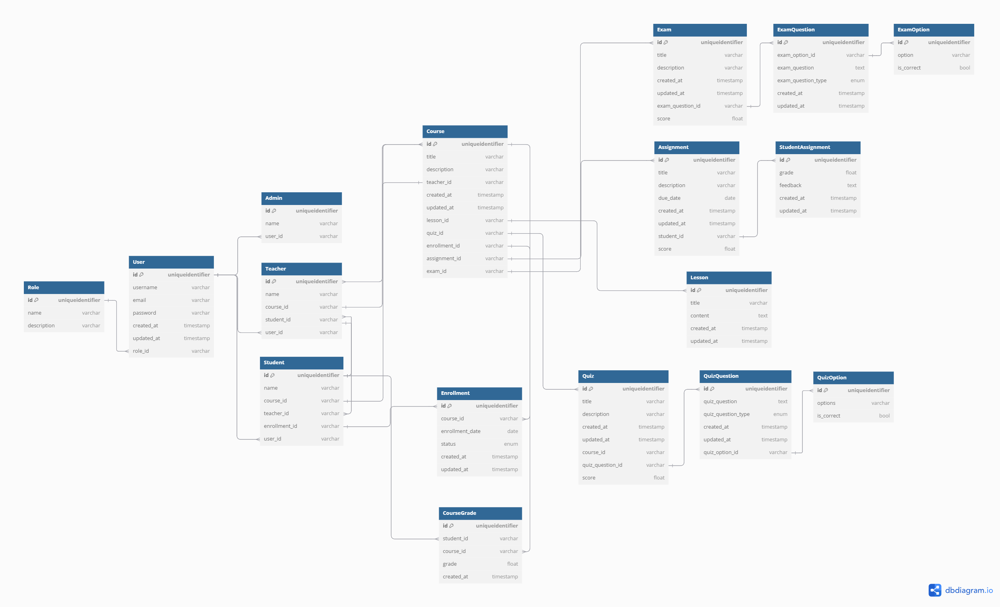

# E - Learning System (LMS)

This project is a E - Learning System (LMS) built with Prisma and MongoDB. It includes roles for Admins, Teachers, and Students, allowing for course management, student enrollments, and assignment grading.

## Table of Contents
- [Entity Relationship Diagram (ERD)](#entity-relationship-diagram-erd)
- [Database Schema](#database-schema)
- [Setup Instructions](#setup-instructions)
- [API Endpoints](#api-endpoints)
- [Contributors](#contributors)

## Entity Relationship Diagram (ERD)
Below is the ERD showing the relationships between models:




## Database Schema
The system is modeled using Prisma ORM with MongoDB. The schema includes:

- `User` (Base model for authentication)
- `Role` (Admin, Teacher, Student)
- `Admin` (Admin-specific attributes)
- `Student` (Students and their enrollments)
- `Teacher` (Instructors managing courses)
- `Course` (Courses with lessons, quizzes, and exams)
- `Enrollment` (Tracking student participation)
- `Assignment`, `Exam`, `Quiz` (Evaluation models)

For a detailed schema, see [`prisma/schema.prisma`](prisma/schema.prisma).


This is a [Next.js](https://nextjs.org) project bootstrapped with [`create-next-app`](https://github.com/vercel/next.js/tree/canary/packages/create-next-app).

## Getting Started

First, run the development server:

```bash
npm run dev
# or
yarn dev
# or
pnpm dev
# or
bun dev
```

Open [http://localhost:3000](http://localhost:3000) with your browser to see the result.

You can start editing the page by modifying `app/page.js`. The page auto-updates as you edit the file.

This project uses [`next/font`](https://nextjs.org/docs/app/building-your-application/optimizing/fonts) to automatically optimize and load [Geist](https://vercel.com/font), a new font family for Vercel.

## Learn More

To learn more about Next.js, take a look at the following resources:

- [Next.js Documentation](https://nextjs.org/docs) - learn about Next.js features and API.
- [Learn Next.js](https://nextjs.org/learn) - an interactive Next.js tutorial.

You can check out [the Next.js GitHub repository](https://github.com/vercel/next.js) - your feedback and contributions are welcome!

## Deploy on Vercel

The easiest way to deploy your Next.js app is to use the [Vercel Platform](https://vercel.com/new?utm_medium=default-template&filter=next.js&utm_source=create-next-app&utm_campaign=create-next-app-readme) from the creators of Next.js.

Check out our [Next.js deployment documentation](https://nextjs.org/docs/app/building-your-application/deploying) for more details.
# e-learning
